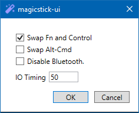

###### Apple Keyboard USB Adapter for PC

# About

**magicstick.io** is an absolutely zero-hassle, user programmable, USB adapter for connecting Apple keyboards (Magic 1, Magic 2 or the older Apple Wireless) to PCs, game consoles, smart TVs, etc. providing the correct keymap translation.

That is, you get a working _Delete_, _Ctrl_, _Page Up/Down_, _Print Screen_, Multimedia keys etc. You also get dual connection modes, wired and Bluetooth. All modern versions of Windows (since Windows 95 OSR2) and Linux are supported. Additionally, any device that accepts conventional USB keyboards should work with it, such as game consoles or smart TVs.

<table>
    <tr>
        <td></td>
        <td></td>
        <td></td>
        <td></td>
        <td></td>
    </tr>
    <tr>
        <td>Keyboard USB port</td>
        <td>Side view</td>
        <td>Wired connection</td>
        <td>Wireless connection</td>
        <td>Inside view</td>
    </tr>
    <tr>
        <td></td>
        <td></td>
        <td></td>
        <td></td>
        <td></td>
    </tr>
    <tr>
        <td>Inside view</td>
        <td>MagicStickUI Settings</td>
        <td>MagicStickUI Battery Indicator</td>
        <td>MagicStickUI Firmware update</td>
        <td></td>
    </tr>
</table>

**magicstick.io** started as a hobby. I wanted to use my Apple keyboard on Windows but without developing a dedicated Windows kernel-mode driver, especially given how difficult this is with the latest Windows kernel-mode driver signing restrictions (e.g. see my [WinAppleKey](https://github.com/samartzidis/WinAppleKey) project). 

## How to get a magicstick.io Device

You can order a hand-made _plug-and-play_ magicstick.io dongle from: 

## User Manual

The user manual is [here](docs/README.md).

## Firmware Release Notes

The firmware release notes are [here](release-notes.md).

## Supported Apple Keyboard Models

| Model | Status |
| -------- | ------- |
| A1314 | Old keyboard. Supported but no UI battery level indicator in MagicstickUI. |
| A1644, A1843, A2450 | Fully supported. |
| A2449 | Supported - but without fingerprint sensor functionality (yet). |

## Features

- magicstick.io is powered by a **133MHz dual-core Arm Cortex M0+** processor. All processing logic is implemented in **optimized C/C++ and assembly** code and is utilizing both processor cores. The dual USB stack is managed by the first core and the Bluetooth stack is managed by the second core.
- magicstick.io can function **both wired and wirelessly**. You can connect your Apple keyboard either via a standard USB to Lightning cable or wirelessly via Bluetooth. 
- You can freely switch between wired or wireless connection modes at any time.
- Wired and Bluetooth operation modes provide **surprisingly fast response times**. Tests performed with online measurement tools could not detect any extra delays over the default 16ms rebounce delay of a A1644 keyboard.

  
  
  _The above measurement was done on [clickspeedtester.com](https://www.clickspeedtester.com) using an A1644 keyboard. It averaged the same between (all) MagicStick-wired, MagicStick-Bluetooth, and direct PC USB (that is without MagicStick and with no extra Windows drivers installed)_.
- magicstick.io is a microcontroller-based device so it **works immediately** as soon as it is powered on. This allows you to use the keyboard as early as at the PC boot process, e.g. for accessing the BIOS/UEFI menus. Also since there is no Operating System driver required, the keyboard just works correctly in BIOS/UEFI mode.
- **Programmable**. magicstick.io incorporates a user programmable key rules engine that allows you to directly **map** keys or key combinations to **custom multimedia** functions or to **Unicode** characters (e.g. μ) and **Emojis** (e.g. 👍) (on Windows OS).
- magicstick.io supports an OS **battery level indicator** in both wired and wireless connection modes in both **Windows** and **Linux**. Ubuntu Linux natively supports a battery-level indicator whereas for Windows you can use the [MagicStickUI](docs#the-magicstickui-utility) utility.
- magicstick.io is built with **security** in mind. Its HID interface is open (see MagicStickUI GitHub source code) and locked down to a standard keyboard HID API on the side that connects to the PC plus a few extra reports for monitoring the battery level and configuring keys. The Bluetooth connection has Level 2 security enabled (wireless encryption). Additionally, Bluetooth can be completely disabled if needed via settings.
- In contrast to other similar solutions (e.g. MagicUtilities), magicstick.io has **no subscription fees** or any connected device restrictions. You own the device, and you can connect it to **as many keyboards or computers** as you like.
- **PC sleep/wake-up** is supported and works **in both wired and Bluetooth** connection modes (in contrast to pure software solutions such as MagicUtilities). The Bluetooth wake-up support is particularly useful for media centre PCs that you would normally want to wake up from a distance when hitting a key on the keyboard. 
- **Firmware updates**. Any future improvements, such as support for new keyboard models are easy to install and are provided for free.

## Compliance and Safety

The magicstick.io hardware is based on a programmed Raspberry Pi Pico W microcontroller. Please refer to this official link for details on [compliance and safety approvals](https://pip.raspberrypi.com/categories/688).

## Disclaimer

magicstick.io was professionally developed with <3 and attention to detail, following software engineering best practices. There is no 100% guarantee however that it will work for your particular setup neither I accept responsibility for anything going wrong to your equipment (including explosions, earthquakes and floods) or to you directly or indirectly through its use. By accepting to use the device and related software you also accept full responsibility for all of the above. When you order a magicstick.io device from _Etsy_, it is returnable and refundable based on the associated _Etsy_ site policy.

 

