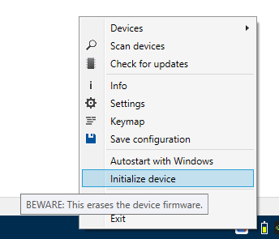
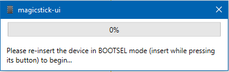
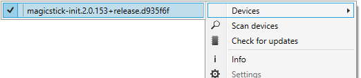

## Build Your Own Device Instructions

This process is not 100% free, but it is cheaper than purchasing a ready-made magicstick.io device, especially if you already own a *Raspberry Pi Pico W* board.

### Hardware

> If you are OK with only Bluetooth connectivity and you are not interested in the wired connectivity (implying no wired charging as well), you can skip (2).
If you are not interested in the plastic enclosure, you can skip (3). In that case you just need a *Raspberry Pi Pico W* board and jump straight to the Device Preparation section!

1. You need to purchase a genuine *Raspberry Pi Pico W* board from a vendor in your area. 
2. You also need a female USB Type-A port and some _28AWG_ silicone cable for the wiring. Use the wiring schematics [here](../schematics) to solder the USB Type-A port to the board as shown.
3. Use the 3D print STL files [here](../case) to print the plastic case.

### Device Preparation

For the following process, you will need to work on a Windows PC.

1. Download and install the [magicstick-ui](https://github.com/samartzidis/magicstick.io/releases). 

2. Run the magicstick-ui utility (from the desktop icon), then right click on its System Tray icon and select the **Initialize device** option. 

3. You will be asked to plug your **Raspberry Pi Pico W** device in [BOOTSEL mode](./README.md#entering-into-bootsel-mode). The device will be auto-detected and flashed with the initialization firmware.

4. In the magicstick-ui Utility, click the **Scan devices** option and select the "magicstick-init" device that now appears in the device list. 

5. Next, select the **Info** option and copy the 16-letter/digit **Device Serial** number.

6. **Purchase** your device firmware from [Etsy](https://www.etsy.com/uk/listing/1709718352/magicstickio-firmware), by supplying the **Device Serial** number you copied in the previous step in the order form.

7. Plug your "Raspberry Pi Pico W" device in BOOTSEL mode again. In Windows File Explorer, copy the purchased and downloaded firmware file (e.g. E6612385208E4736.uf2) directly to the "Raspberry Pi Pico W" device, which should appear in Windows as a flash drive named "RPI-RP2".

The device will automatically restart as a brand new raspikey.io device. 

You can now refer to the user [manual](./README.md).

