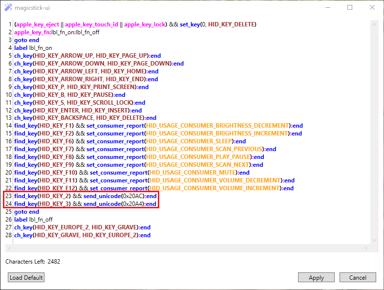

[](https://github.com/samartzidis/magicstick.io)
###### Apple Keyboard USB Adapter for PC

# User Manual


| Label | Description |
| -------- | ------- |
| **A** | **Keyboard** connection, USB Type-A port. |
| **B** | **PC** connection, micro-USB port. |
| **C** | **BOOTSEL**/**RESET** button. |
| **D** | Operation **LED** |

## Connecting a Keyboard

### Wired Connection

This is the simplest mode of connection and your keyboard should just work by plugging it into the USB-A female port (the bigger USB port) of the device labelled **A** in the diagram. You will need a **USB-A to Lightning** cable.

The micro-USB connection labelled **B** must be connected to one of your PC's USB ports.

### Bluetooth Connection

#### Connecting the Newer A1644, A2450, A2449 Keyboards

Connecting any of these keyboards is pretty straightforward. 

1. Remove any keyboard currently plugged-in to magicstick.io.
2. Turn the keyboard off and then on again. 

   

3. Plug the magicstick.io device to a USB port and keep it close to the keyboard. magicstick.io should discover the keyboard and pair with it. There is no PIN code entry required.

#### Connecting the Older [A1314](https://en.wikipedia.org/wiki/Apple_Wireless_Keyboard#/media/File:Apple-wireless-keyboard-aluminum-2007.jpg) Keyboard

The older A1314 keyboard has a little bit more complicated pairing process. 

**Important:** Make sure that the magicstick.io device is first **reset to factory settings**, so that it holds no previous paired keyboard data in its internal memory, by following [these steps](#Factory-Resetting-the-Device).

1. Remove any keyboard currently plugged-in to magicstick.io.
2. Turn the A1314 keyboard off by constantly pressing the right side button for a few seconds. You will see the green keyboard led powering off in a fading out fashion.
3. Turn the A1314 keyboard on by constantly pressing the right side button for a few seconds. Keep pressing it until the green led starts flashing. The keyboard is now in discovery mode.
4. (Unplug if plugged-in and) plug-in again your magicstick.io device to a PC USB port. magicstick.io will try to discover the keyboard. When the magicstick.io LED starts flashing non-stop, the keyboard is discovered and pairing has started. Immediately type **0000** (that is, four zeros) on the keyboard and press <kbd>Enter</kbd>.
5. The keyboard should be now paired and connected.
If this process fails repeat from step 1.

## The magicstick-ui Windows Utility


The magicstick-ui utility allows you to monitor the keyboard's connection status, monitor the battery level (both when wired or in Bluetooth), as well as to change the keyboard's special keys configuration and default keymap. You can also use it for permanently turning the magicstick.io Bluetooth chip on or off, for instance if you are in a very high IT security work environment.

To download the magicstick-ui utility, check the [release notes](../release-notes.md) page.

## LED Status Reference

The LED is located at the diagram position marked **D**. The following table summarizes the various LED flashing states of the device:

| LED Status | Meaning |
|------------|---------|
| LED is **on**. | A keyboard is connected via wired or Bluetooth connection. |
| LED is **off**. | Device malfunction. |
| LED is **flashing** non-stop. | Bluetooth has initiated **pairing** mode. Depending on the keyboard model you may need to enter **0000** and press <kbd>Enter</kbd> on the keyboard to complete pairing or just wait, see [Connecting a Keyboard](#Connecting-a-Keyboard) for details. |
| **1 flash** and a pause. | **IDLE**. magicstick.io is operational but no keyboard is connected via wire connection or Bluetooth. |
| **2 flashes** and a pause. | **Bluetooth** **CONNECTING**. magicstick.io Bluetooth is trying to connect to an already paired keyboard via Bluetooth. |
| **3 flashes** and a pause. | **Bluetooth** **INQUIRING**. magicstick.io Bluetooth is in inquiry (aka discovery) mode trying to discover and pair with a suitable keyboard nearby. |

## Keymap

When you connect your keyboard for the first time, this is the default keymap:

| Input Key(s)  | Output Key    |
| --- | --- |
| <kbd>Left Ctrl</kbd>  | <kbd>Fn</kbd> |
| <kbd>Fn</kbd> | <kbd>Left Ctrl</kbd> |
| <kbd>⏏︎ Eject</kbd> or <kbd>🔒 Lock</kbd> | <kbd>Del</kbd> |
| <kbd>⌘ Cmd</kbd>  | <kbd>Alt</kbd>    |
| <kbd>⌥ Alt/Option</kbd>  | <kbd>Cmd</kbd>    |
| <kbd>Fn</kbd> + <kbd>[F1]</kbd> | Brightness Down |
| <kbd>Fn</kbd> + <kbd>[F2]</kbd> | Brightness Up |
| <kbd>Fn</kbd> + <kbd>[F6]</kbd> | Sleep (Windows OS) |
| <kbd>Fn</kbd> + <kbd>[F7]</kbd> ... <kbd>[F12]</kbd> | Multimedia Keys</kbd> |
| <kbd>Fn</kbd> + <kbd>Return</kbd>   | <kbd>Insert</kbd> |
| <kbd>Fn</kbd> + <kbd>⌫</kbd>    | <kbd>Del</kbd>    |
| <kbd>Fn</kbd> + <kbd>P</kbd>    | <kbd>Print Screen</kbd> |
| <kbd>Fn</kbd> + <kbd>S</kbd>    | <kbd>Scroll Lock</kbd> |
| <kbd>Fn</kbd> + <kbd>B</kbd>    | <kbd>Pause/Break</kbd> |
| <kbd>Fn</kbd> + <kbd>&uarr;</kbd>   | <kbd>Page Up</kbd> |
| <kbd>Fn</kbd> + <kbd>&darr;</kbd>   | <kbd>Page Down</kbd> |
| <kbd>Fn</kbd> + <kbd>&larr;</kbd>   | <kbd>Home</kbd>   |
| <kbd>Fn</kbd> + <kbd>&rarr;</kbd>   | <kbd>End</kbd>    |

## Keymap Programming

> **Note:** This is an advanced feature and mostly suited to people with a bit of programming background. If you do not feel that you have programming skills you may have difficulty in getting things right or you may even render the device slow and unresponsive if done something terribly wrong. If that happens there is always the [reset](#Factory-Resetting-the-Device) option.

<details>
<summary>
   Expand.
</summary>
   
The magicstick.io keymap is programmable via custom rules. This allows you to: 
- Physical key remapping. 
- Remap keys to target the majority of the HID Keyboard scan codes as per USB HID Usage Tables specification 1.12, under the Keyboard/Keypad and Consumer Pages, totalling 200+ of keys and functions.
- Program keys for typing extended ASCII characters, unicode characters and emojis.

To access the default key map, right-click on the utility icon and select Keymap to open the keymap editor.


You will then see the keymap rules editor showing the current default rules: 


A keymap rule can be one of the following 3:

1. **label** [label name]
2. **goto** [label name]
3. [**expression**] **:** [goto **label** if expression evaluates to true] **:** [goto **label** if expression evaluates to false]

   _or_

   [**expression**] **:** [goto **label** if expression evaluates to true]

   _or_

   [**expression**]

(1) A **label** rule defines a place/anchor in the program. The label name can be a word consisting of alphanumeric characters and underscores but starting with an underscore or a letter. E.g. **lbl_1**, **_lbl1**, **lastlbl**, etc.

(2) A **goto** rule tells the rules engine to jump to a particular label location in the list, by label name.

(3) An expression rule, executes and evaluates the result of an expression. If the expression result is true (i.e. any number except 0) it jumps to the rules list location specified by [goto **label** if expression evaluates to true]. If the result is false (equals 0), it jumps to the rules list location specified by [goto **label** if expression evaluates to false]. The goto sections are optional and if they are missing, execution will just continue with the next rule in the list until the end of the list.

Below is a further explanation of the default rules:


### Physical Key Remapping

magicstick.io supports the remapping of a physical key via keymap rules. For instance, for swapping the blue and red circled keys,


the default keymap already includes the following 2 rules using the **ch_key** function:

```
ch_key(HID_KEY_EUROPE_2, HID_KEY_GRAVE):end
ch_key(HID_KEY_GRAVE, HID_KEY_EUROPE_2):end
```

You can remove these two rules if you would prefer to not swap these keys.

#### Deleting all the Remapped Keys

To delete all the remapped keys one-off, you can:
1. Click the **Load Default** button in the keymap editor to load the default keymap.
Or
2. Reset the device to factory settings by following [these steps](#Factory-Resetting-the-Device).

#### Remapping of Special Keys (including standard modifier keys)

##### Swap Fn-Ctrl

This can be easily done in **Settings**.

##### Swap Alt-Cmd

This can be easily done in **Settings** by selecting:


Alternatively, you can code the rules in the key map editor. This will allow you more fine-grained control, such as to only swap the Left or the Right Alt-Cmd keys, etc.

Rule to swap left <kbd>⌥ Alt/Option</kbd> with left <kbd>⌘ Cmd</kbd>:

```
(mod & KEYBOARD_MODIFIER_LEFTALT != 0) ^ (mod & KEYBOARD_MODIFIER_LEFTGUI != 0) && set_mod(mod ^ (KEYBOARD_MODIFIER_LEFTALT | KEYBOARD_MODIFIER_LEFTGUI))
```
You can add a similar rule to swap the **KEYBOARD_MODIFIER_RIGHTALT** and **KEYBOARD_MODIFIER_RIGHTGUI** keys if needed.


### Emulating Numeric Keypad Number Keys

Emulating these keys can be useful for entering Alt-codes under Windows, that require the use of a numeric keypad, which the Apple Magic keyboard does not have.

The following set of rules shows how to map the <kbd>Fn</kbd> + <kbd>0 - 9</kbd> key combinations to: Numeric Keypad keys <kbd>0 - 9</kbd>:

<details>    
    <summary><b>Click to expand/collapse.</b></summary>

```
ch_key(HID_KEY_1, HID_KEY_KEYPAD_1):end
ch_key(HID_KEY_2, HID_KEY_KEYPAD_2):end
ch_key(HID_KEY_3, HID_KEY_KEYPAD_3):end
ch_key(HID_KEY_4, HID_KEY_KEYPAD_4):end
ch_key(HID_KEY_5, HID_KEY_KEYPAD_5):end
ch_key(HID_KEY_6, HID_KEY_KEYPAD_6):end
ch_key(HID_KEY_7, HID_KEY_KEYPAD_7):end
ch_key(HID_KEY_8, HID_KEY_KEYPAD_8):end
ch_key(HID_KEY_9, HID_KEY_KEYPAD_9):end
ch_key(HID_KEY_0, HID_KEY_KEYPAD_0):end
```

</details>
</br>

These rules must be entered after the "label lbl_fn_on" line and before the "goto end" line, so that they are taken into consideration when <kbd>Fn</kbd> is pressed.

### Entering Unicode Characters and Emojis

> **Note:** This functionality only works on Windows OS and requires the magicstick-ui utility to be running in the tray. Also please note that the program that you are typing in to must have Unicode support (e.g. Windows WordPad or Microsoft Word).

For entering **Unicode** characters, you need to know the **hexadecimal Unicode point value** of the character. You can use [these tables](https://www.quackit.com/character_sets/unicode/versions/unicode_9.0.0/) for this.

The following example shows how to program the key shortcut <kbd>Fn</kbd> + <kbd>2</kbd> to type the **€** character:

```
find_key(HID_KEY_2) && send_unicode(0x20AC):end
```

The following example shows how to program the key shortcut <kbd>Fn</kbd> + <kbd>3</kbd> to type the **£** character:

```
find_key(HID_KEY_3) && send_unicode(0x20A4):end
```

You will need to add both of the above rules after the "label lbl_fn_on" line and before the "goto end" line so that they are activated when <kbd>Fn</kbd> is pressed, as seen in lines 23-24:



You can also type Emojis, for example say that you would like to map <kbd>Fn</kbd> + <kbd>Y</kbd> to 👍 and <kbd>Fn</kbd> + <kbd>N</kbd> to 👎. This can be done like so:

```
find_key(HID_KEY_Y) && send_unicode(0x1F44D):end
find_key(HID_KEY_N) && send_unicode(0x1F44E):end
```

For a more complex example, assuming that would allow you to map: 

<kbd>Fn</kbd> +  to the Unicode character **≠**

and 

<kbd>Fn</kbd> + <kbd>Shift</kbd> +  to the Unicode character **±**

You'll need these rules:

```
!mod && find_key(HID_KEY_EQUAL) && send_unicode(0x2260):end
(mod & KEYBOARD_MODIFIER_LEFTSHIFT) && find_key(HID_KEY_EQUAL) && send_unicode(0xB1):end
```

Note how we also need to consult the **mod** keystroke modifiers (flags) variable value to check whether the <kbd>Shift</kbd> key is pressed or not.

### Mapping a Key to Multiple Sequential Keystrokes

This example shows how to map a single keystroke to multiple sequential keystrokes. We will map <kbd>Fn</kbd> + <kbd>H</kbd> to send 2 sequential keystrokes for typing the word "hi". This can be coded like so:

```
find_key(HID_KEY_H) && (send_key(0, HID_KEY_H), send_key(0, HID_KEY_I)):end
```

Or as another example, we will map <kbd>Fn</kbd> + <kbd>X</kbd> to send the 2 emojis: 👍👎. This can be coded like so:
```
find_key(HID_KEY_Y) && (send_unicode(0x1F44D), send_unicode(0x1F44E)):end
```
</details>

## Firmware Updates

1. Download the latest (or the desired) **uf2** firmware file and associated magicstick-ui utility **exe** file from the [release notes](../release-notes.md) page. The firmware file should be something like that: magicstick.x.x.x+release.xxxxxxx.**uf2**.
2. Enter magicstick.io to [BOOTSEL mode](#Entering-into-BOOTSEL-Mode). 
3. Once magicstick.io is in BOOTSEL mode, a new **File Explorer** window will open in your desktop, titled: **RPI-RP2**. If this window does n't open automatically, you can still open it manually in **File Explorer**:

   
   
   

4. Copy the downloaded **uf2** firmware file there. Once the copy completes, your magicstick.io device will automatically restart, running the new firmware.

5. If desired, you can now also run the downloaded magicstick-ui.exe UI utility (from step 1) to control the device.

## Entering into BOOTSEL Mode

BOOTSEL is a special device mode that allows you to write new firmware to it. You should only need to do this to run a manual firmware update or downgrade.

To enter into BOOTSEL mode, unplug magicstick.io and then plug it in while the bootsel button is constantly pressed. This will enter the magicstick.io into bootsel mode.

## Factory Resetting the Device

You can reset your device's internal memory (programmed keys, Bluetooth pairing etc.) by following these steps:

Unplug the device. Plug it in and as soon as the green LED turns on (it is important to wait until it turns on before you press), press the BOOTSEL button and keep pressing it until the LED starts flashing. Now release the BOOTSEL button. The device's memory will be wiped out and the device will reboot.

It is important to press the BOOTSEL button **after** the LED turns on. If you press it before, the device will enter into BOOTSEL mode instead of resetting, which is not what you want in this case.

As soon as the device resets back to factory settings, it will lose all key remapping information, special keys configuration, as well as any Bluetooth pairing information if it was previously paired with a Bluetooth keyboard. Therefore it will immediately enter into Bluetooth discovery mode again, trying to find a suitable keyboard to pair with.


