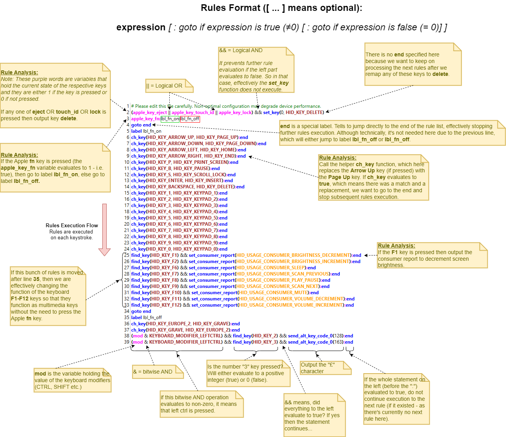

[](https://github.com/samartzidis/magicstick.io)
###### Apple Keyboard USB Adapter for PC

# User Manual


| Label | Description |
| -------- | ------- |
| **A** | **Keyboard** connection, USB Type-A port. |
| **B** | **PC** connection, micro-USB port. |
| **C** | **BOOTSEL**/**RESET** button. |
| **D** | Operation **LED** |

## Connecting a Keyboard

### Wired Connection

This is the simplest mode of connection and your keyboard should just work by plugging it into the USB-A female port (the bigger USB port) of the device labelled **A** in the diagram. You will need a **USB-A to Lightning** cable.

The micro-USB connection labelled **B** must be connected to one of your PC's USB ports.

### Bluetooth Connection

#### Connecting the Newer A1644, A2450, A2449 Keyboards

Connecting any of these keyboards is pretty straightforward. 

1. Remove any keyboard currently plugged-in to magicstick.io.
2. Turn the keyboard off and then on again. 

   

3. Plug the magicstick.io device to a USB port and keep it close to the keyboard. magicstick.io should discover the keyboard and pair with it. There is no PIN code entry required.

#### Connecting the Older [A1314](https://en.wikipedia.org/wiki/Apple_Wireless_Keyboard#/media/File:Apple-wireless-keyboard-aluminum-2007.jpg) Keyboard

The older A1314 keyboard has a little bit more complicated pairing process. 

**Important:** Make sure that the magicstick.io device is first **reset to factory settings**, so that it holds no previous paired keyboard data in its internal memory, by following [these steps](#Factory-Resetting-the-Device).

1. Remove any keyboard currently plugged-in to magicstick.io.
2. Turn the A1314 keyboard off by constantly pressing the right side button for a few seconds. You will see the green keyboard led powering off in a fading out fashion.
3. Turn the A1314 keyboard on by constantly pressing the right side button for a few seconds. Keep pressing it until the green led starts flashing. The keyboard is now in discovery mode.
4. (Unplug if plugged-in and) plug-in again your magicstick.io device to a PC USB port. magicstick.io will try to discover the keyboard. When the magicstick.io LED starts flashing non-stop, the keyboard is discovered and pairing has started. Immediately type **0000** (that is, four zeros) on the keyboard and press <kbd>Enter</kbd>.
5. The keyboard should be now paired and connected.
If this process fails repeat from step 1.

## The magicstick-ui Windows Utility


The magicstick-ui utility allows you to monitor the keyboard's connection status, monitor the battery level (both when wired or in Bluetooth), as well as to change the keyboard's special keys configuration and default keymap. You can also use it for permanently turning the magicstick.io Bluetooth chip on or off, for instance if you are in a very high IT security work environment.

Download the latest magicstick-ui msi installer version from the [releases](https://github.com/samartzidis/magicstick.io/releases) page.

## LED Status Reference

The LED is located at the diagram position marked **D**. The following table summarizes the various LED flashing states of the device:

| LED Status | Meaning |
|------------|---------|
| LED is **on**. | A keyboard is connected via wired or Bluetooth connection. |
| LED is **off**. | Device malfunction. |
| LED is **flashing** non-stop. | Bluetooth has initiated **pairing** mode. Depending on the keyboard model you may need to enter **0000** and press <kbd>Enter</kbd> on the keyboard to complete pairing or just wait, see [Connecting a Keyboard](#Connecting-a-Keyboard) for details. |
| **1 flash** and a pause. | **IDLE**. magicstick.io is operational but no keyboard is connected via wire connection or Bluetooth. |
| **2 flashes** and a pause. | **Bluetooth** **CONNECTING**. magicstick.io Bluetooth is trying to connect to an already paired keyboard via Bluetooth. |
| **3 flashes** and a pause. | **Bluetooth** **INQUIRING**. magicstick.io Bluetooth is in inquiry (aka discovery) mode trying to discover and pair with a suitable keyboard nearby. |

## Keymap

When you connect your keyboard for the first time, this is the default keymap:

| Input Key(s)  | Output Key    |
| --- | --- |
| <kbd>Left Ctrl</kbd>  | <kbd>Fn</kbd> |
| <kbd>Fn</kbd> | <kbd>Left Ctrl</kbd> |
| <kbd>⏏︎ Eject</kbd> or <kbd>🔒 Lock</kbd> | <kbd>Del</kbd> |
| <kbd>⌘ Cmd</kbd>  | <kbd>Alt</kbd>    |
| <kbd>⌥ Alt/Option</kbd>  | <kbd>Cmd</kbd>    |
| <kbd>Fn</kbd> + <kbd>[F1]</kbd> | Brightness Down |
| <kbd>Fn</kbd> + <kbd>[F2]</kbd> | Brightness Up |
| <kbd>Fn</kbd> + <kbd>[F6]</kbd> | Sleep (Windows OS) |
| <kbd>Fn</kbd> + <kbd>[F7]</kbd> ... <kbd>[F12]</kbd> | Multimedia Keys</kbd> |
| <kbd>Fn</kbd> + <kbd>LCtrl</kbd>    | <kbd>Right Ctrl</kbd> |
| <kbd>Fn</kbd> + <kbd>Return</kbd>   | <kbd>Insert</kbd> |
| <kbd>Fn</kbd> + <kbd>⌫</kbd>    | <kbd>Del</kbd>    |
| <kbd>Fn</kbd> + <kbd>P</kbd>    | <kbd>Print Screen</kbd> |
| <kbd>Fn</kbd> + <kbd>S</kbd>    | <kbd>Scroll Lock</kbd> |
| <kbd>Fn</kbd> + <kbd>B</kbd>    | <kbd>Pause/Break</kbd> |
| <kbd>Fn</kbd> + <kbd>&uarr;</kbd>   | <kbd>Page Up</kbd> |
| <kbd>Fn</kbd> + <kbd>&darr;</kbd>   | <kbd>Page Down</kbd> |
| <kbd>Fn</kbd> + <kbd>&larr;</kbd>   | <kbd>Home</kbd>   |
| <kbd>Fn</kbd> + <kbd>&rarr;</kbd>   | <kbd>End</kbd>    |
| <kbd>Fn</kbd> + <kbd>0 - 9</kbd>   | Numeric Keypad <kbd>0 - 9</kbd> |

### Special Function Keys

| Input Key(s)  | Action        |
| --- | --- |
| <kbd>Fn</kbd> + <kbd>Z</kbd>    | Remap (program) key.   |
| <kbd>Fn</kbd> + <kbd>X</kbd>    | Delete a previously remapped (programmed) key.  |
| <kbd>Fn</kbd> + <kbd>Right Shift</kbd>  | Reboot device device in BOOTSEL mode. |
| <kbd>Fn</kbd> + <kbd>Right Shift</kbd>+<kbd>⏏︎ Eject</kbd>   | Erase (factory reset) device.  |
| <kbd>Fn</kbd> + <kbd>Right Shift</kbd>+<kbd>🔒 Lock</kbd>   | Erase (factory reset) device.  |

## Keymap Programming

> Warning: This is an advanced feature and mostly suited to people with a programming background. If you do not feel that you have programming skills you may have difficulty in getting things right or you may even render the device slow and unresponsive if done something terribly wrong. If that happens there is always the [reset](#Factory-Resetting-the-Device) option.

The magicstick.io keymap is programmable via custom rules. This allows you to: 
- Physical key remapping. 
- Remap keys to target the majority of the HID Keyboard scan codes as per USB HID Usage Tables specification 1.12, under the Keyboard/Keypad and Consumer Pages, totalling 200+ of keys and functions.
- Program keys for typing extended ASCII characters, unicode characters and emojis.

To access the default key map, right-click on the utility icon and select Keymap to open the keymap editor.


You will then see the keymap rules editor showing the current default rules: 


A keymap rule can be one of the following 3:

1. **label** [label name]
2. **goto** [label name]
3. [**expression**] **:** [goto **label** if expression evaluates to true] **:** [goto **label** if expression evaluates to false]

   _or_

   [**expression**] **:** [goto **label** if expression evaluates to true]

   _or_

   [**expression**]

(1) A **label** rule defines a place/anchor in the program. The label name can be a word consisting of alphanumeric characters and underscores but starting with an underscore or a letter. E.g. **lbl_1**, **_lbl1**, **lastlbl**, etc.

(2) A **goto** rule tells the rules engine to jump to a particular label location in the list, by label name.

(3) An expression rule, executes and evaluates the result of an expression. If the expression result is true (i.e. any number except 0) it jumps to the rules list location specified by [goto **label** if expression evaluates to true]. If the result is false (equals 0), it jumps to the rules list location specified by [goto **label** if expression evaluates to false]. The goto sections are optional and if they are missing, execution will just continue with the next rule in the list until the end of the list.

Below is a further explanation of the default rules:




### Physical Key Remapping

magicstick.io supports the remapping of a physical key via keymap rules. For instance, for swapping the blue and red circled keys.


The default keymap already includes the following 2 rules using the **ch_key** function:

```
ch_key(HID_KEY_EUROPE_2, HID_KEY_GRAVE):end
ch_key(HID_KEY_GRAVE, HID_KEY_EUROPE_2):end
```

You can remove these two rules if you would prefer to not swap these keys.

#### Deleting all the Remapped Keys

To delete all the remapped keys one-off, you can:
1. Click the **Load Default** button in the keymap editor to load the default keymap.
Or
2. Reset the device to factory settings by following [these steps](#Factory-Resetting-the-Device).

#### Remapping of Special Keys

The previous sections explained how to remap standard keys such as letter keys. Modifier keys such as Shift, Alt and Ctrl cannot be remapped with the exception of swapping the Fn-Ctrl and the Alt-Cmd keys. 

##### Swap Fn-Ctrl

This can be done in **Settings**.

##### Swap Alt-Cmd

This can be done in **Settings** by selecting:


Alternatively, you can code the rules in the key map editor. This will allow you more fine-grained control, such as to only swap the left or right Alt-Cmd keys, etc.

Rule to swap Left Alt with Left Command:
```
(get_mod() & KEYBOARD_MODIFIER_LEFTALT) && set_mod((get_mod() & ~KEYBOARD_MODIFIER_LEFTALT) | KEYBOARD_MODIFIER_LEFTGUI)
```
The above rule says if the pressed modifiers match the KEYBOARD_MODIFIER_LEFTALT, then remove the KEYBOARD_MODIFIER_LEFTALT and add the KEYBOARD_MODIFIER_LEFTGUI.

Rule to swap Left Command with Left Alt:
```
(get_mod() & KEYBOARD_MODIFIER_LEFTGUI) && set_mod((get_mod() & ~KEYBOARD_MODIFIER_LEFTGUI) | KEYBOARD_MODIFIER_LEFTALT)
```
The above rule says if the pressed modifiers match the KEYBOARD_MODIFIER_LEFTGUI, then remove the KEYBOARD_MODIFIER_LEFTGUI and add the KEYBOARD_MODIFIER_LEFTALT.

You can add 2 similar rules to swap the KEYBOARD_MODIFIER_RIGHTALT and KEYBOARD_MODIFIER_RIGHTGUI keys.

### Entering Extended ASCII and Unicode Characters

Please note that this only works under Windows, as it takes advantage of the special Windows Alt-codes functionality. Also, the program that you are typing in to must have Unicode support for entering Unicode characters (e.g. Windows WordPad or Microsoft Word).

The following example shows how to program the key shortcut <kbd>Ctrl</kbd> + <kbd>2</kbd> to type the **€** character:
```
(get_mod & KEYBOARD_MODIFIER_LEFTCTRL) && find_key(HID_KEY_2) && send_alt_key_code_0(128):end
```

The following example shows how to program the key shortcut <kbd>Ctrl</kbd> + <kbd>3</kbd> to type the **£** character:
```
(get_mod & KEYBOARD_MODIFIER_LEFTCTRL) && find_key(HID_KEY_3) && send_alt_key_code_0(163):end
```

If you like, add any or both of the above two rules at the end of the default keymap list to test.

For the full list of extended ASCII key codes like the ones above, see [here](https://www.alt-codes.net/).

For entering Unicode characters, you need to use the decimal value of the Unicode character that you'd like to enter. You can use [this table](https://www.quackit.com/character_sets/unicode/versions/unicode_9.0.0/dingbats_unicode_character_codes.cfm) to find that.

As an example, say that you'd like to map the ✌ (victory hand) character to the key combination <kbd>LCtrl</kbd>+<kbd>LShift</kbd>+<kbd>V</kbd>. For this, you can create the following rule:

```
(get_mod & KEYBOARD_MODIFIER_LEFTCTRL) && (get_mod & KEYBOARD_MODIFIER_LEFTSHIFT) && find_key(HID_KEY_V) && send_alt_key_code(9996):end
```

Or if you'd like to do the same using the <kbd>Fn</kbd>+<kbd>V</kbd> key combination, place this at the end of the rules list:

```
apple_key_fn && find_key(HID_KEY_V) && send_alt_key_code(9996):end
```

Or alternatively, place this somewhere after the line 'label fn_on' (so that you can shorten the expression a bit):
```
find_key(HID_KEY_V) && send_alt_key_code(9996):end
```

Note that in this case we are using the **send_alt_key_code** and not the **send_alt_key_code_0** function as done previously because the Alt code **9996** does not have a leading **0**.

## Firmware Updates

#### Firmware Update Using the magicstick-ui Utility
This is the recommended way as it is easier than the manual one but you need to have access to a Windows PC to run magicstick-ui.

1. Right-click on the magicstick-ui tray icon and select: _Check for updates_. 

2. If a new update is found, you will get a confirmation dialog asking to update. Accept, and the upgrade will start and complete automatically. 

   

3. The device will automatically reboot to the updated version.

#### Manual Firmware Update
This _"brute force"_ method is useful if you have no access to a Windows PC or if for any reason the device had been previously flashed with a bad, non-working firmware (bricked).

1. To download the firmware for your magicstick.io device, you need your device's serial number. On **Windows**, use the magicstick-ui utility to retrieve it. On **Linux**, you can find it by typing this command in a terminal: ```upower -d```
The content in the red box is the device's serial number.

   

So in that case, the serial number starts with E66 and finishes with 32.

2. Download the latest magicstick.io firmware by opening the following link in your browser, but by first replacing the word SERIAL with your actual serial number: ```https://magicstick-app.azurewebsites.net/api/download/SERIAL/magicstick-latest.uf2``` 
(E.g. ```https://magicstick-app.azurewebsites.net/api/download/E66138468234AA31/magicstick-latest.uf2```)
3. Enter magicstick.io into [BOOTSEL mode](#Entering-into-BOOTSEL-Mode). 
4. Once magicstick.io enters BOOTSEL mode, a new **File Explorer** window will open in your desktop, titled: **RPI-RP2**. If this window does n't open automatically, you can still open it manually in **File Explorer**:

   
   
   

6. Copy the downloaded **magicstick-latest.uf2** firmware file there. Once the copy completes, your magicstick.io device will automatically restart running the new firmware.

## Entering into BOOTSEL Mode

BOOTSEL is a special device mode that allows you to write new firmware to it. You should only need to do this if you would like to run a manual firmware update or downgrade process. There are two ways to achieve this:

**First Way:** Press Fn-Right Shift-Del (i.e. Eject) on your keyboard.

**Second way:** Unplug magicstick.io and then plug it in with the bootsel button being constantly pressed. This will enter the magicstick.io into bootsel mode.

## Factory Resetting the Device

You can reset your device's internal memory (programmed keys, Bluetooth pairing etc.) by following these steps:

Unplug the device. Plug it in and as soon as the green LED turns on (it is important to wait until it turns on before you press), press the BOOTSEL button and keep pressing it until the LED starts flashing. Now release the BOOTSEL button. The device's memory will be wiped out and the device will reboot.

It is important to press the BOOTSEL button **after** the LED turns on. If you press it before, the device will enter into BOOTSEL mode instead of resetting, which is not what you want in this case.

As soon as the device resets back to factory settings, it will lose all key remapping information, special keys configuration, as well as any Bluetooth pairing information if it was previously paired with a Bluetooth keyboard. Therefore it will immediately enter into Bluetooth discovery mode again, trying to find a suitable keyboard to pair with.


## DIY - Build Your Own Device Instructions

### Hardware Resources

1. You will need to purchase a genuine *Raspberry Pi Pico W* board from a vendor in your area. 
2. You will also need a female USB Type-A port and some _28AWG_ silicone cable for the wiring. Use the wiring schematics [here](../schematics) to solder the USB Type-A port to the board as shown.
3. Use the 3D print STL files [here](../case) to print the plastic case.

**Notes:**
If you are OK with just Bluetooth connectivity and not interested in wired connectivity (implying no wired charging as well), you can skip step (2) above.
If you are not interested in the plastic enclosure, you can skip step (3) above.

### Device Preparation

For the following process, you will need to work on a Windows PC.

1. Download and install the [magicstick-ui](#The-magicstick-ui-Windows-Utility). 

2. Run the magicstick-ui utility (from the desktop icon), then right click on its System Tray icon and select the "Initialize device" option. 

3. You will be asked to plug your "Raspberry Pi Pico W" device in [BOOTSEL mode](#entering-into-bootsel-mode). The device will be auto-detected flashed with the initialization firmware.

3. In the magicstick-ui Utility, click the "Scan devices" option and select the "magicstick-dummy..." device that now appears in the device list. Next, select the "Device info" option and copy the device's serial number.

4. Order your device firmware from [Etsy](https://www.etsy.com/uk/listing/1709718352/magicstickio-firmware), by supplying the 16-digit serial number you copied in the previous step in the order form.

5. Plug your "Raspberry Pi Pico W" device in BOOTSEL mode again, and now in Windows File Explorer, copy the downloaded firmware file directly to the "Raspberry Pi Pico W" device, which should appear on Windows as "RPI-RP2".

After step 5, the device will automatically restart as a new raspikey.io device.


